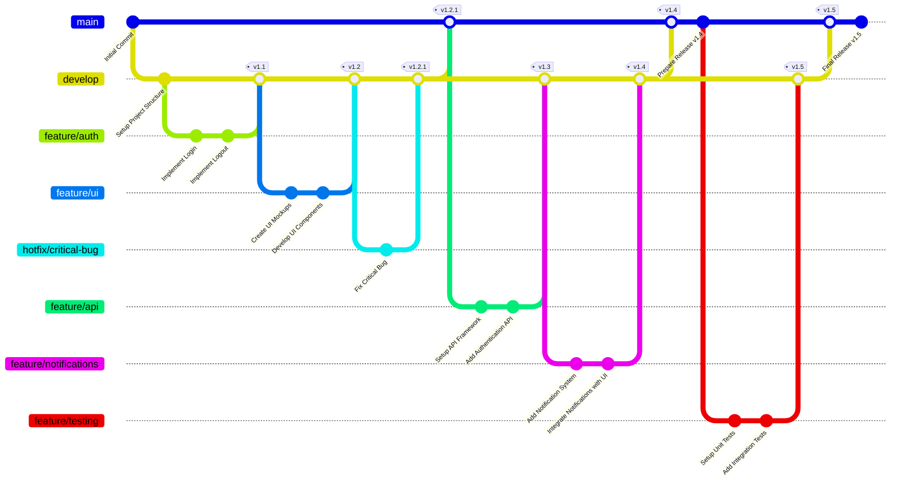

# Implementation_Algorithms
Implementation_Algorithms

- [x] Линейная регрессия 
- [x] Градиентный спуск 
- [x] K-ближайших соседей (K-Nearest Neighbors) 
- [x] Метод опорных векторов (Support Vector Machines) 
- [x] Decision Tree
      
- [ ] Нейронные сети
  - [x] Основы
  - [ ] Forward Propagation и Back Propagation 

